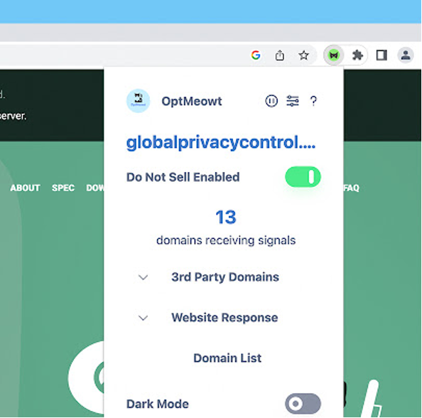
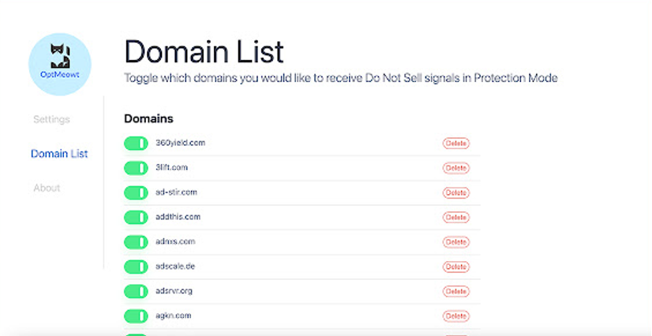
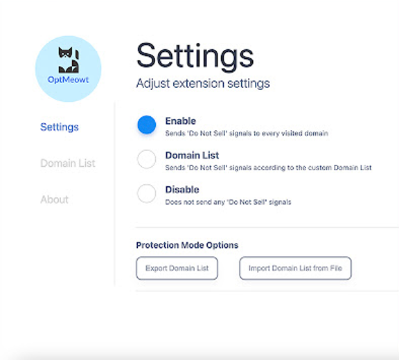
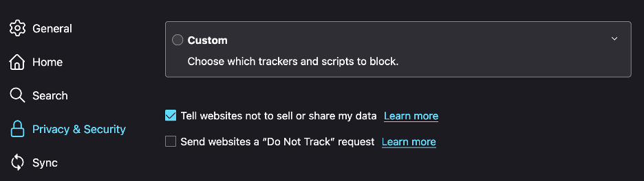
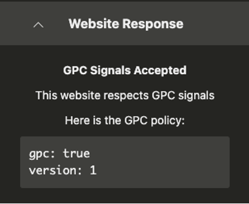

# Global Privacy Control (GPC) Explainer

Editors: 
[Aram Zucker-Scharff]
Justin Brookman
Sebastian Zimmeck

## 0. tl;dr

Global Privacy Control (GPC) is a proposed specification designed to allow Internet users to notify businesses of their preference to not have their personal information sold or shared, or used for targeted advertising. It consists of a setting or extension in the user’s browser that provides a mechanism that websites can use to indicate they support the specification.

[1. Draft Specification](#1-draft-specification)  
[2. Background](#2-background)  
[3. Solution](#3-solution)  
[4. Legal Effects](#4-legal-effects)  
[5. Additional Interpretation Options and Explanations](#5-additional-interpretation-options-and-explanations)  
[6. User Experience Considerations and Recommendations](#6-user-experience-considerations-and-recommendations)  
[7. Alternatives Considered](#7-alternatives-considered)

## 1. Draft Specification

You can find the draft specification [here](https://github.com/privacycg/gpc-spec).

## 2. Background

An increasing number of laws and regulatory environments require that sites respect people’s choices to not be tracked. While these laws describe privacy choices in different ways it is clear that they represent an interest in giving people the capability to exercise a right to privacy and that people have an interest in exercising that right.

Some laws establish a requirement for a universal control that can present this opt out request at a user-agent level automatically, making it easier for people to exercise their rights without negotiating a site-level user interface.

With this in mind the GPC specification proposes a way for user-agents to present people’s preferences to opt out to sites via both a header and a JavaScript object. The specification intends to capture the standard ways sites currently handle opt out choices.

The motivation of GPC is to:

1. Make it easy for people to clearly and unambiguously present their privacy preference to a website and the various technologies it may run.
2. Allow website developers to incorporate people’s privacy choices with as little delay and complexity as possible.

The specification also provides an option for sites to provide a GPC Support Resource that allows sites to state that they are aware of and support the GPC specification. Some laws or regulatory environments may require GPC compliance. The goal of the GPC Support Resource is to allow sites to demonstrate their support actively. This demonstration is useful to regulators, lawyers, and activists in determining the impact of people’s privacy choices as well as sites’ awareness. It is also useful in giving people a clear signal that their privacy choices are respected to the best of a site’s ability.

## 3. Solution

The GPC signal is either on or not present. If it is on, then an individual is expressing a privacy choice, for example, to opt out of the sale and data sharing per the California Consumer Privacy Act (CCPA). Sites may choose to support this request beyond what they are legally required to do and their vendors may choose to do so as well.

Requests from a device or browser that supports GPC and where people have activated the GPC signal must contain **both** the header and an addition to the navigator object readable by JavaScript.

### 3.1 Header

The following header **must** be on every request:

`Sec-GPC: 1`

### 3.2 Navigator Object

The property that is added to the navigator object is

`navigator.globalPrivacyControl`

Its value will always be `true` or the property will not be set. **The signal is expected to be active at the time the page loads.**

### 3.3 Signal Behavior

The signal is always either **present and true** or **not present**. This design is rooted in providing full clarity of the signal.

The specification presents this design to assure that there can be no mistake in understanding the intent or state of the signal. If the signal is active, it is expected that it is expressing an individual’s privacy choice.

### 3.4 GPC Support Resource

The GPC Support Resource should be at `https://{yourwebsite.com}/.well-known/gpc.json`. The GPC Support Resource should only be hosted by domains that are concerned with listening to the signal. If you develop technology to emit the signal, it is not intended that the GPC Support Resource is stating something about your technology.

A website that is intending to listen to and take action based on the GPC signal in any way should have the following style object in that JSON file:

`{ "gpc": true, "lastUpdate": "1997-03-10" }`

The `lastUpdate` value is meant to reflect your understanding of the specification. If the specification changes in such a way as to not be backwards compatible, this value gives adopters the capacity to note their understanding of the signal being based on the state of the GPC specification at the particular time they last updated the file.

Sites may respect GPC without the GPC Support Resource. Sites that do not respect GPC may do so either by setting `gpc` to `false` or not providing the GPC Support Resource. User-agents may parse the GPC Support Resource and announce its presence, lack of presence, or values to people in a way that indicates their understanding of the domain’s support for GPC. Not all legal regimes may consider sites able to reject the GPC signal. Consult your lawyer if you intend to reject the GPC signal.

## 4. Legal Effects

The specification is designed to express a generic preference to have their data not shared or sold, or used across different contexts for targeted advertising. The spec discusses a number of laws and regulations that may be implicated by declaring such a preference, though legal effects will ultimately be determined by local regulators. This list is intended to provide examples, not be complete. Website operators may also choose to respect GPC beyond the legal requirements.

There are situations where the design of GPC, by intent, matches specific legal or regulatory mechanisms. The intent is to connect GPC to specific laws and legally-understood requests by users to allow users to exercise privacy rights at scale.

### 4.1 GPC in the US

The [CCPA Regulations](https://oag.ca.gov/privacy/ccpa/regs) provide specific language supporting consumer’s use of a global privacy control. GPC was created with the intent to supply users with the ability to exercise CCPA and related opt out requests. GPC compliance is [enforced by the Office of the California Attorney General](https://oag.ca.gov/news/press-releases/attorney-general-bonta-announces-settlement-sephora-part-ongoing-enforcement) and the California Privacy Protection Agency.

The Colorado and Connecticut privacy laws also have specific global opt out mechanisms mentioned in their text. The GPC signal is designed to invoke these and similar laws to express the specific opt out rights people have under those laws, where applicable. Additional U.S. privacy laws with such global opt out rights are Montana, Oregon, Texas, and Delaware.

Virginia and Utah have privacy laws that grant people the right to opt out but do not have information about specific mechanisms. While the law does not explicitly require respecting GPC in those states, GPC intends to provide a signal to opt out using those rights and regulators are free to adopt it.

### 4.2 GPC outside the US

The European Union and European Economic Area have the General Data Protection Regulation (GDPR). This law provides for a number of bases for data processing, including consent and the "legitimate interest" of the data controller. For processing pursuant to a company’s "legitimate interest," Article 21 of the GDPR offers people an ability to object, or opt out, of such processing. As GPC is intended to convey a general request that data controllers limit the sale or sharing of the person's personal data to other data controllers, European regulators may deem GPC to constitute a legally binding invocation of Article 21 rights. To date, no European regulator has explicitly made this case, though some commentators have argued that [GPC has legal effect under the GDPR](https://berjon.com/gpc-under-the-gdpr/).

## 5. Additional Interpretation Options and Explanations

Where laws arise to provide Internet privacy GPC intends to have a very specific privacy purpose. **It asks domains not to share or sell people’s personal data, or to use personal data across different contexts, using similar definitions to CCPA and other U.S. state privacy laws.** Other nationalities or regions may choose to incorporate the signal directly or may find user-agents using it. While the legal or regulatory requirements to respect GPC vary, people’s intent in exactly what they are requesting should be considered consistently.

GPC is not necessarily intended to invoke every new privacy right in every jurisdiction. For example, GPC is not intended to globally invoke data deletion rights on every website people visit. GPC is also not intended to limit a first party’s use of personal information within the first-party context (such as a publisher targeting ads to an individual on its website based on that individual’s previous activity on that same site). For that reason, GPC should not be interpreted as exercising the CCPA’s right to limit the use of sensitive information in a first-party context.

## 6. User Experience Considerations and Recommendations

It is not considered standard for W3C specifications to present user interface recommendations or restrictions. User interfaces are the domain of user-agents who, being closest to the user, best understand how their users interpret and react to the underlying functionality. For GPC, some user-agents may present themselves as privacy-focused technology, in which case it may make sense for the signal to be defaulted to on at all times, which, for example, is supported in California and Colorado for privacy-focused technology. Some user-agents may be generic, with no expectation for people setting defaults. Some user-agents may present GPC in different formats and devices and necessitate unique user interface requirements.

This explainer presents examples of user-agent user interfaces for GPC as an aid to adopters who are interested in or required to implement GPC as to how it can be presented.

### 6.1 Example Presentations of User-agent Level UI

The following examples come from the [OptMeowt browser extension](https://github.com/privacy-tech-lab/gpc-optmeowt), which is developed at the [privacy-tech-lab](https://privacytechlab.org/) at Wesleyan University, and reflects best practices for GPC. We also show how Mozilla surfaces the GPC setting in Firefox. These examples are shown to illustrate. They are not meant as a comprehensive set of UIs for GPC.

Whichever user interface applications are implemented, they are expected to meet accessibility standards.

User interfaces are further expected to have a clear visible switch for turning on the GPC signal that can clearly distinguish between active and inactive. **For GPC "active" always means an individual is exercising their choice to opt out of sharing and cross-site usage to the extent provided by the law.**

  
The OptMeowt popup showing GPC details of the current site.

User-agents may choose to allow people to manage the GPC signal for individual domains. The Individual domains can be represented to the user as a list that clearly indicates their settings. In such a list people may be able to add individual domains, domains may be automatically added, and people may manage domains on which they have already made an active choice, or exclude domains from the GPC opt out signal being active. When people choose a GPC setting for a site, it is expected that the user-agent retain that setting until they make an active choice to change it.

  
The OptMeowt domain list for setting GPC on individual sites.

It is expected that most people will choose if they want to universally activate GPC across all domains and requests. Interfaces should reflect GPC’s intent to be as straightforward and simple as possible. People may also choose to disable GPC universally for their user-agent.

  
The universal GPC setting of OptMeowt.

  
The universal setting of GPC in the Firefox browser settings.

A user interface can show what response is at `https://{yourwebsite.com}/.well-known/gpc.json` and display that information to the users so they can understand what claims the website is making in terms of GPC compliance. This can be done regardless of the properties included on the JSON document, the main concern is the value of the `gpc` property, as seen here.

  
An example of how GPC responses can be surfaced (OptMeowt).

### 6.2 User-agents

The above examples are from an extension in a web browser. User-agents should implement similar interface conventions. The authors of this document recommend that user-gents have some way to display to people the state of their GPC signal when it is on during the course of regular interaction with the site instead of putting it behind a settings page.

A setting should be included to manage GPC. At the very least a simple Boolean-value switch should be available to the user within settings to manage GPC universally for the user-agent.

If GPC is not turned on by default, there should be a control that is accessible to people to turn it on when interacting with an individual site.

If the user-agent makes the GPC setting visible when active, it should retain individuals’ privacy choices when they turn off GPC for a specific site.

User-agents should not challenge people with a request to set GPC in either mode beyond initial setup. Per-domain settings of GPC should be up to an individual to engage with, not pushed via a notification, modal, pop-up, or similar interactive element.

### 6.3 Adopting on Your Website

Given the complexities of existing privacy choice and consent frameworks, sites that implement GPC should disclose how they treat it in any jurisdiction for which they adopt it and how they deal with conflicts between a GPC signal and other specific privacy choices that an individual has already made directly with the site, including instances where third party sharing may be permitted, such as sharing to service providers/processors or at the direction of the individual.

Where industry standards set specific strings or signals that are needed to communicate people’s privacy choices, sites should anticipate translating GPC into the downstream signal. A good example of such setting is handling GPC to set California-based US Privacy Strings for advertising technology:

```javascript
if (
    navigator.globalPrivacyControl &&
    identityObject.geoState === 'CA'
) {
    this.uspapi.uspStringSet = true;
    this.uspapi.setUSPString(`1YYY`);
} else if
```

Setting the USPAPI for propagating GPC downstream.

Generally website developers should consider GPC signals to be identical to a user flipping the opt out switch on their website and take action accordingly.

## 7. Alternatives Considered

The authors of GPC considered other options for how the signal would work. The current state of privacy controls across the world is varied. The authors have experience both working on and implementing these more complex controls and found that people generally consider them to be unnecessarily complex. If people intend to make privacy choices, they almost always intend to exercise their rights broadly, e.g., opting out from all sites they visit, no matter how many individual controls exist. More recent laws have also adopted this understanding and moved towards requiring universal or significantly fewer degrees of control. GPC reflects this understanding of people’s privacy choices and, therefore, works in support of these laws.

The signal has been through a few iterations with the specification before it was submitted to the W3C. More complex signals, more extensive data, and different delivery formats were all considered. Additional complexity in the signal creates fingerprinting risk. Delivering the signal for JavaScript-based consumers via a promise was considered as a more privacy-preserving option that would allow greater complexity but was rejected to prefer performance and simplicity.

Removal of the GPC Support Resource was considered as well as further simplification of the contents. However, the maintenance of both the GPC Support Resource as an indicator of compliance and the presentation of the date were both reinforced during consultation with lawyers as extremely useful for maintaining documented compliance and dealing with potential legal activity, especially in cases of specification updates.
